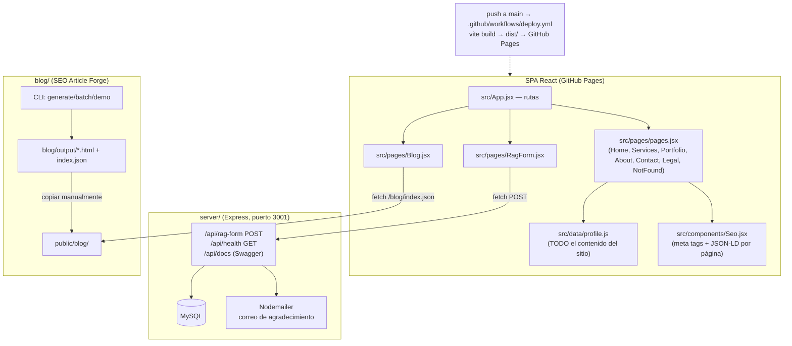

# CLAUDE.md

This file provides guidance to Claude Code (claude.ai/code) when working with code in this repository.

## Qué es este proyecto

Web personal de desarrollador freelance (**easyprodigital.com**) de Jesús Manuel Cristancho. Es un monorepo con tres partes independientes, cada una con su propio `package.json` y `node_modules`:

1. **Raíz** — SPA en React 18 + Vite + React Router 7, desplegada en GitHub Pages.
2. **`server/`** — API Express (MySQL + Nodemailer + Swagger) para el formulario de descubrimiento (`/rag-form`). Corre aparte, NO se despliega en Pages.
3. **`blog/`** — "SEO Article Forge": generador CLI de artículos HTML estáticos con IA. Su salida se copia a `public/blog/` y la SPA la lee como contenido estático.

## Arquitectura



Puntos clave del diseño:

- **Todo el contenido editable vive en `src/data/profile.js`** (servicios, proyectos, textos, contacto). Para cambiar contenido del sitio, casi siempre se edita ahí, no en los componentes.
- **`src/pages/pages.jsx` contiene varias páginas en un solo archivo** (Home, Services, Portfolio, About, Contact, Legal, NotFound). Solo `RagForm` y `Blog` tienen archivo propio.
- **El blog no tiene backend**: `Blog.jsx` lee el manifiesto `/blog/index.json` y enlaza HTML estático en `public/blog/`. Los artículos se generan con `blog/` y se copian a `public/blog/`.
- **SEO**: cada página usa el componente `Seo` (title/description/canonical/OG únicos + JSON-LD). Hay redirects de URLs del sitio anterior (`/plan`, `/sign_in`, `/log_in`) en `App.jsx` para conservar enlaces indexados. `sitemap.xml` y `robots.txt` en `public/`.
- **SPA en GitHub Pages**: el build copia `dist/index.html` a `dist/404.html` para que las rutas profundas funcionen. `public/CNAME` mantiene el dominio propio (`base: '/'` en `vite.config.js`).

## Comandos

### Frontend (raíz)

```bash
npm install
npm run dev        # Vite en http://localhost:5173
npm run dev:all    # frontend + backend juntos (scripts/run-dev.mjs, busca puerto libre desde 3001)
npm run build      # vite build → dist/ + copia dist/index.html a dist/404.html
npm run preview
```

### Backend

```bash
cd server && npm install && npm start   # http://localhost:3001, Swagger en /api/docs
```

Configuración por variables de entorno: `DB_HOST/DB_PORT/DB_USER/DB_PASSWORD/DB_NAME` (MySQL, default `easyprodigital`) y `SMTP_HOST/SMTP_PORT/SMTP_USER/SMTP_PASS` (si no hay `SMTP_HOST`, no se envían correos pero la API funciona).

### Blog (generador de artículos)

```bash
npm run blog:demo      # genera artículos de demostración
npm run blog:generate  # genera un artículo
npm run blog:batch     # lote (ver blog/temas.example.txt y blog/config/default.js)
```

No hay tests ni linter configurados.

## Deploy — ⚠️ regla crítica

El deploy a producción es **solo** vía `.github/workflows/deploy.yml`: push a `main` → `npm ci && npm run build` → publica `dist/` en GitHub Pages (Settings → Pages → Source: **GitHub Actions**).

**Nunca agregar otro workflow que publique a Pages** (p. ej. el sample "Deploy Jekyll" que sugiere GitHub, o "deploy from branch"). En julio de 2026 un `jekyll-gh-pages.yml` agregado desde la UI compitió con `deploy.yml` y desplegó el código fuente sin compilar (`index.html` apuntando a `/src/main.jsx`), dejando el sitio en blanco. Si el sitio vuelve a quedar en blanco, verificar primero que `curl https://easyprodigital.com` devuelva un `index.html` con `/assets/index-*.js` (build real) y no `/src/main.jsx` (fuente sin compilar).

El trabajo se hace en la rama `react` y se integra a `main` por PR/merge; el push a `main` es lo que dispara el deploy.
